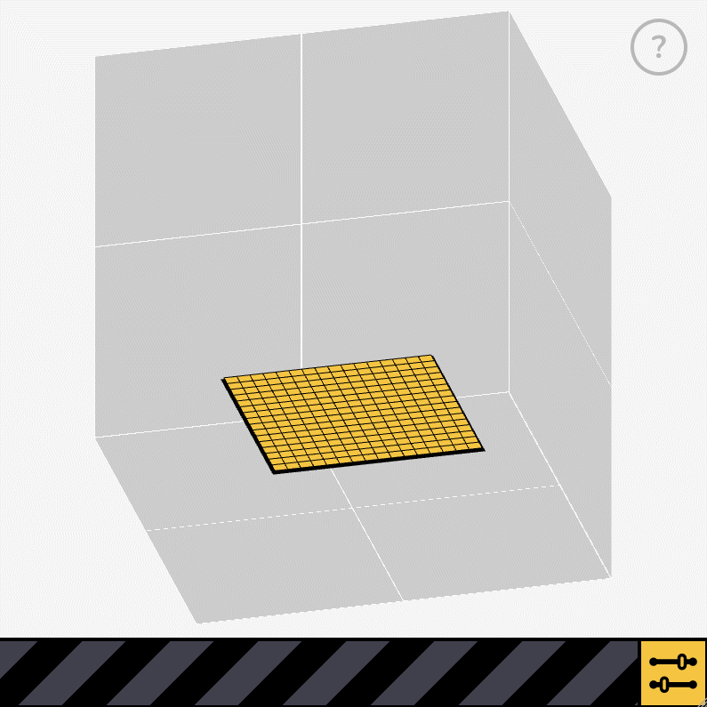
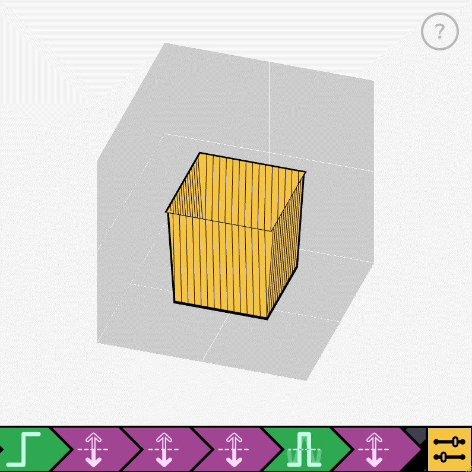
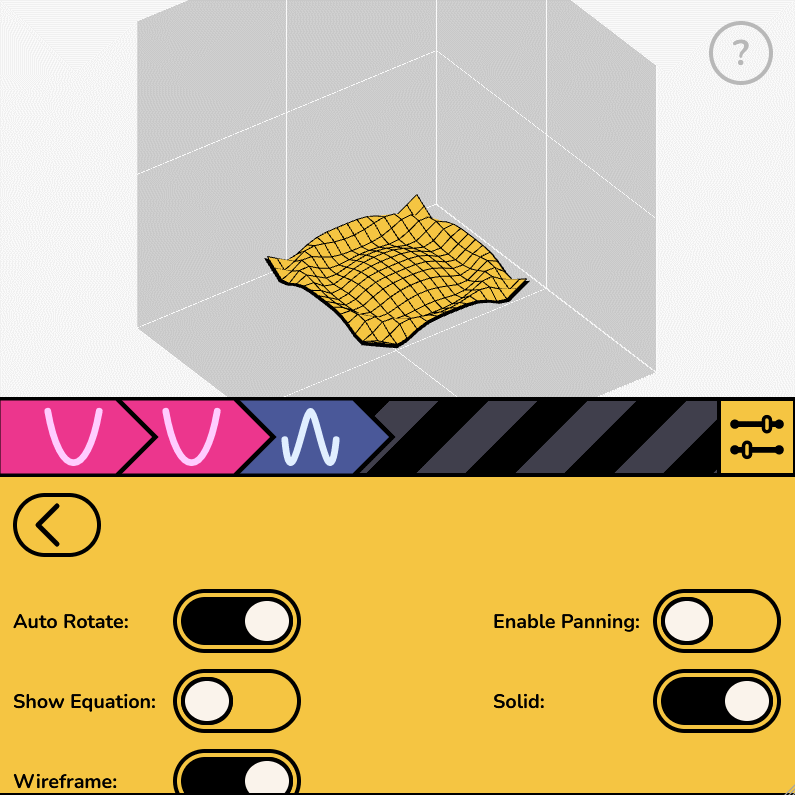

  

<h3 align="center">  
  <a href="https://contort-plotter.pages.dev/">Try It Out</a>
</h3>

---

Contort is a 3D surface plotter (or 3D graphing calculator, if you prefer) that attempts to abstract math expressions into a colorful chain of "modifiers" to deliver a fun, game-ified learning experience.

---

  
   
  

---

Credits & Licensing
---
Copyright (c) 2022 Mike K. ([zlrc](https://github.com/zlrc))

Except where otherwise noted\*, this project is licensed under [AGPLv3](COPYING). If you wish to use the same name or branding in your own project, I would heavily prefer that you first contact me (Mike K.) for approval before doing so.

If you would like to use any 3D visuals that you create with the Contort website in your own works or lessons, please link back to either the website or this repository. Thanks.

\* Please refer to the additional licenses inside the corresponding folders:

- <a href="/src/utils">`src/utils`</a> (licensed under GPLv3)

- <a href="/src/icons">`src/icons`</a> (contains CC Licenses)

Supporting this Project
---

### Reporting Bugs, Questions, & Issues
Please use the [github issue tracker](https://github.com/zlrc/contort-plotter/issues). Do note that this project is a submission to the second annual [Summer of Math Exposition](https://www.youtube.com/watch?v=hZuYICAEN9Y) and certain things might not be addressed until the review process finishes on Sept. 15th, 2022 (at the earliest).

### Contributing
Refer to [CONTRIBUTING.md](CONTRIBUTING.md)

### Leaving a Tip
***NOTE***: *All tips go to the [project maintainer, Mike K.](https://github.com/zlrc)*

---
Built with [Vue3](https://vuejs.org/) + [Vite](https://vitejs.dev/)
